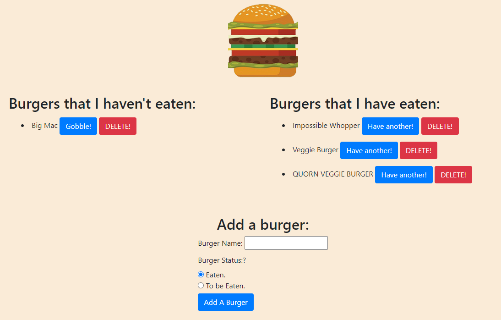

# Unit 13 Burger Logger  

## Description
    This is a deployed website with full CRUD capabilities. 

  
  ## Table of Contents
  1. [Installation](#Installation)
  2. [Usage](#Usage)
  3. [Tests](#Tests)
  4. [GitHub Links](#GitHubLinks)

  ## Installation
  
    NPM install will install all the needed dependencies. You'll also need to add the schema and seeds to the database.
  
  ## Usage

    node server.js. The website is also deployed live. You can interact with the functionality there. Everything is a basic interface where you click on buttons to interact with the website.
  
  ## Tests
  
    npm tests. No Tests provided.
   
  ## GitHubLinks
  
  [Git Hub Username](https://www.github.com/CodySamuels)
  
  [The Repo](https://github.com/CodySamuels/burger-logger)

  [The Deployed Link](https://cs-burger.herokuapp.com/)